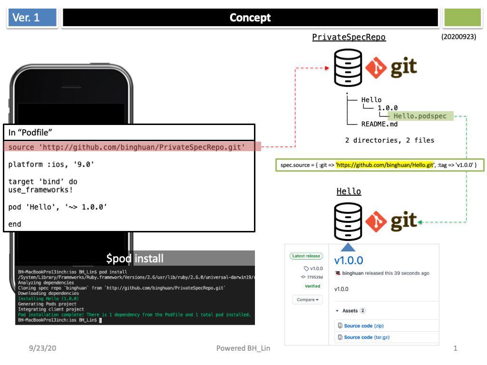

# Use Your Private Pod Repo

# Create a Private Spec Repo
PrivateSpecRepo: <https://github.com/binghuan/PrivateSpecRepo>

# How to use private pod repo in iOS Project

### 1st: Add source and pod info. in file "Podfile"

<code>
	source 'http://github.com/binghuan/PrivateSpecRepo.git'
</code>

### 2st: Add pod name and version
<code>
	pod 'Hello', '~> 1.0.0’
</code>

# Demo

# Related Project: 
- How to create cocoapods <https://guides.cocoapods.org/making/private-cocoapods.html>
- Hello: <https://github.com/binghuan/Hello>
- use_private_repo: <https://github.com/binghuan/use_private_pod>